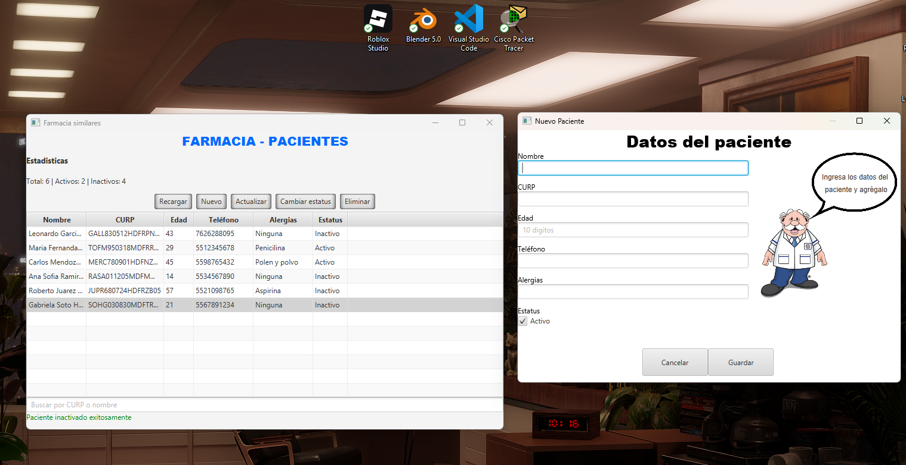
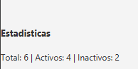
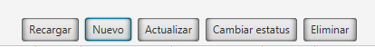
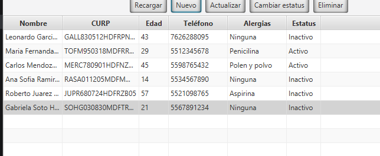
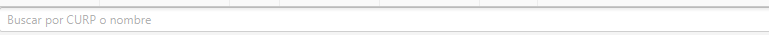
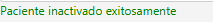
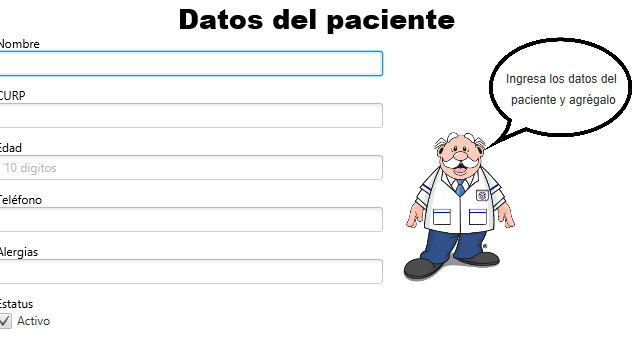
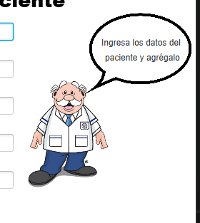

# utez-2d-pacientes-javafx-equipo05

# SISTEMA DE CLINICA



## ¿Qué hace este programa?

Este programa es un sistema CRUD (Create, Read, Update, Delete) con presistencia dedicada al registro de pacientes de una clinica. Puedes ver un listado en una tabla de todos los pacientes, registrar nuevos, editar datos y dar de baja registros de ellos.

Los pacientes tienen estos datos:

- Nombre
- Curp
- Edad
- Telefono
- Alergias

# Cómo ejecutar el programa

## Pasos

1. Clona o descarga el repositorio:
   ```bash
   git clone https://github.com/LeonardoAntonio2026/utez-2d-pacientes-javafx-equipo05.git
   cd utez-2d-pacientes-javafx-equipo05
   ```

2. Ejecuta el programa con Maven:
   ```bash
   mvn clean javafx:run
   ```

3. El programa abrirá la ventana principal automáticamente. Los datos se guardan en el archivo `data/persons.csv`, que se crea automáticamente si no existe.

---


## Pantallas

### Pantalla principal

#### Estadisticas

En la pantalla principal en un texto puedes ver estadisticas del total de tus pacientes y cuantos de ellos estan activos y inactivos.   


#### Botones de acciones

Puedes encontrar una lista de botones:

- Recargar: Sirve para actualizar los datos de la tabla. Es util si los datos fueron editados externamente mientras estaba abierto el programaba

- Nuevo: Abre una ventana nueva con el formulario para añadir un paciente.

- Acutalizar: Puedes actualizar los datos de un paciente. Necesitas seleccionar a uno en la tabla antes.

- Cambiar status: Alterna el status de un paciente seleccionado en la tabla.

- Eliminar: Da de baja a un paciente cambiando su status a inactivo.



#### Tabla de pacientes

Aquí vas a visualizar todos los pacientes que tengas registrados en forma de una tabla con sus datos en cada columna.



#### Barra de busqueda

Aquí puedes filtrar los elementos de la tabla por nombre o curp de los pacientes para agilizar el proceso de busqueda.



#### Mensaje de contexto

Puedes recibir un feedback del resultado de tu acción. Puede ser un mensaje o un error.



### Formulario

Esta ventana se puede abrir cuando agregas o editas a un paciente y contiene campos de texto con todos los datos del paciente. Tiene validaciones en cada campo.



#### Doctor simi

Cuando abras el formulario el doctor simi te explicará lo que tienes que hacer. Tambien te dira cuando una validacion no es valida para que puedas corregirla.



#### Botones

Hay 2 botones. Con uno puedes cancelar tu acción y con otro puedes guardar los datos ingresados en los campos de texto. Si das guardar el doctor simi va a revisar y validar que todo este bien.


## Requisitos previos

- **Java 25** o superior instalado.
- **Maven** instalado (o usar el wrapper incluido `mvnw`).


# Estructura del proyecto

El proyecto se divide en capas donde cada archivo cumple una función específica.

Las capas son:

AppController y FormularioController > PersonService > PersonFileRepository > persons.csv

o seá:

Capa que controla la interfaz > Capa de lógica de negocio > Capa de acceso a datos > Persistencia


## Modelo `Paciente.java`

Representa como se estructuran los datos del paciente. Define que cada paciente tiene una curp, nombre, edad, telefono, alergias y su estatus. Tambien crea funciones para acceder o establecer sus datos.

## Repositorio — `PersonFileRepository.java`

Se encarga únicamente del acceso al archivo `data/persons.csv`. No contiene lógica de negocio. Sus métodos son:

- `readAllLines()` — lee y devuelve todas las líneas del archivo.
- `appendNewLine(line)` — agrega una nueva línea al final del archivo.
- `appendAllLines(pacientes)` — sobrescribe todo el archivo con la lista completa de pacientes.

## Servicio — `PersonService.java`

En esta capa está toda la lógica de negocio. Usa el repositorio para manejar los registros y expone operaciones de alto nivel:

- `loadDataForList()` carga todos los pacientes del archivo.
- `loadDataForListSearch(search)` filtra pacientes por nombre o CURP.
- `addPerson(paciente)` valida y agrega un nuevo paciente. Lanza un error si el CURP ya existe.
- `updatePerson(index, ...)` actualiza los datos de un paciente existente por su índice.
- `changeEstatus(index)` alterna el estatus activo/inactivo de un paciente.
- `deletePerson(index)` da de baja a un paciente cambiando su estatus a inactivo (baja lógica).
- `countTotal()`, `countActivos()`, `countInactivos()` contadores utilizados para el resumen estadístico.

## Controladores

### `AppController.java`

Controla la pantalla principal. Conecta la interfaz (tabla, botones, barra de búsqueda y etiquetas) con el servicio.

- Al iniciar configura las columnas de la tabla y el listener de la barra de búsqueda.
- Maneja los botones: Nuevo, Actualizar, Cambiar estatus, Eliminar y Recargar.
- Abre el formulario como ventana modal en modo alta o edición según corresponda.
- Muestra mensajes de éxito o error en la etiqueta de contexto.

### `FormularioController.java`

Controla la ventana del formulario para dar de alta o editar un paciente.

- Si recibe `null` opera en modo alta; si recibe un objeto `Paciente` precarga los campos para edición.
- Al guardar valida los campos, detecta el modo (alta o edición) y llama al método correspondiente del servicio.
- Al cerrar (guardar o cancelar) notifica al `AppController` para que refresque la tabla.                     